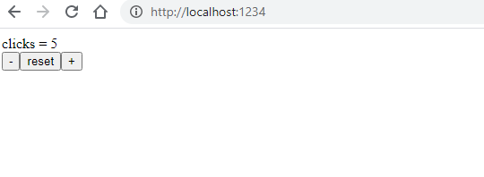

# 02 - JSX

(TODO: Describe JSX)

## Using html inside javascript

All the `React.createElement` code is annoying, lets use an aletrnative file type that allows using more html like syntax.

### Task - Render a React element

In [index.html](./src/index.html) We want the ability to load `jsx` files as well as js files:

```html
<!-- ... -->
<script src="https://unpkg.com/babel-standalone@6/babel.min.js"></script>
<script src="App.js"></script>
<script src="index.js"></script>
```

We know have the ability to transpile jsx files at runtime. In [index.html](./src/index.html) update the App import to:

```html
<script src="App.jsx" type="text/babel"></script>
```

Rename `App.js` to `App.jsx` and update the return value to:

```jsx
return <button onClick={increment}>
  Interactive, clicks = {count}
</button>
);
```

Do the same to also rename `index.js` to `index.jsx`

In your terminal run: `npm start` in the `exercises/02` folder.
Open [http://localhost:1234](http://localhost:1234) in your browser

### Task - Update App to have more functionality

Update `App.jsx` to have the following design, with the implicit functionality.


